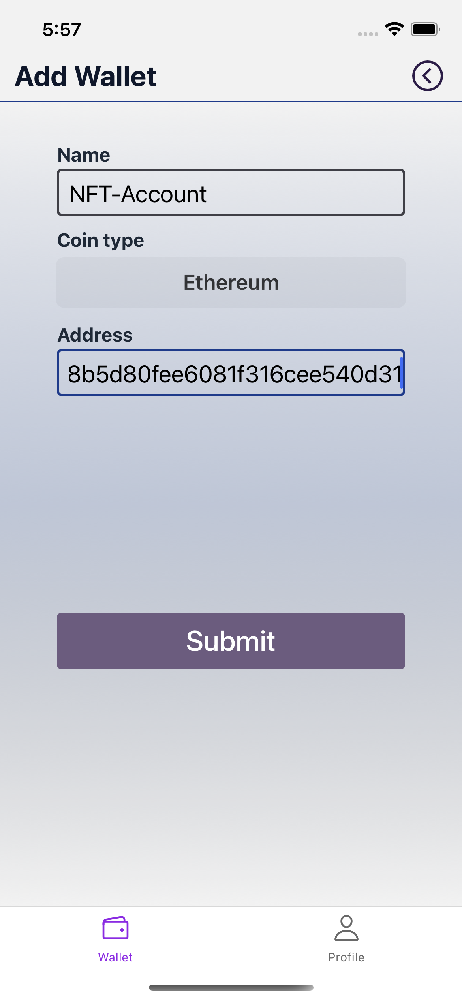

# *CoinGuard*
## 🧐 Background
### 🧓🏻 Personal
I first got exposed to Clojure when I was doing consensus verification for a homebrewed PBFT protocol with the [Jepsen tool](https://github.com/jepsen-io/jepsen). The time was around mid 2018.

Attracted to this language, I swallowed through books like `Clojure In Action`, `Programming Clojure`, `The Joy of Clojure`, `Elements of Clojure` and more. The Clojure sub on Reddit and the Clojurian slack channel are also my all-time favorites.

In the meantime, I also played with `4Clojure`, `Exercism`, and tried out toy projects like writing `AWS Lambda Functions` with Clojure. 

**However, after some time, I've reached a point where I feel I shall write more serious projects in Clojure**.

### 👨‍💻 Project 

I then kickstarted a side-project fully in `Clojure`. The name is `CoinGuard`, which is about alerting users when their crypto account balances change. Functionality-wise it is nothing special, but it serves my purpose of exploiting `Clojure` from more perspectives and for real purposes.

The project status is yet **on-going**; I kept developing and refurbishing the code when I have the urge.

## 🏛 Overview Architecture

Three components are involved:

- **Mobile Client**

  A one-stop mobile app that allows the user to configure the monitoring and alerting rules on her crypto assets. Currently only ETH is supported.

- **Cloud Platform**

  K8s-based cloud platform to empower the microservices. The project mainly focuses on configuring the platform in an IaC manner with [Pulumi](https://www.pulumi.com/).

- **Micro Services**

  The services run on the K8s platform. They are the indexing service that fetches changed user accounts, the rule service that executes monitoring rules and the notification service that sends alerts to the users.

## 📂 Directory Layout

We have three top level directories:

- **infra**

  This directory contains the IaC for setting up the K8s cluster itself.

  - **docker/**

    Docker images for `clojure` dev, `xtdb` and `datomic`.

  - **pulumi-azure/**

    IaC based configuration with `pulumi` to spin up Azure K8s cluster. 

  - **hetzner/**

    To reduce the cost of Azure K8s, the hetzner/ directory contains code to spin up an alternative K3s cluster on the [Hetzner](https://www.hetzner.com/) provider. It uses `babashka` to execute the custom deployment commands and uses `terraform` to apply for resources.

- **coinguard**

  This directory contains the backend source code and the mobile app source code. It also contains the IaC configuration for running the backend services on K8s (see the sub `infra` directory). 

  - **backend/**

    - The backend services use `integrant` to manage component lifecyle. 
    - For API handling, we use `ring/reitit`. 
    - We use Postgres as datastore with the `next.jdbc` library, and `flyway` for schema migration.
    - `malli` is used to perform spec validation and transformation. 
    - `babashka` is used to glue tasks like lint, image building, deployment, etc. 
    - Also, `core.async` and custom thread pool are used to perform concurrent task handling. 
    - Other goodies are also covered like task retry, app configuration, http operations, etc.
    
    During implementation, some thoughts are taken from [startrek](https://github.com/dharrigan/startrek) and [penpot](https://github.com/penpot/penpot/tree/develop/backend). 

  - **mobile/**

    - The mobile application is based on `reagent/react`. 
    - It uses `shadow-cljs` to manage project build. 
    - We integrate with `react-native-mmkv` for secure storage, `tailwind` (twrnc) for `css-in-js` custom styling, `i18n-js` for internationalization, `core.async` for asynchronous task handling, and other widely available react ecosystem libraries.
    - We didn't use `reframe` since `core.async` already met the requirements and was less complex (YMMV).
    
    During the implementation, the very initial version was a trimmed one based on [statusim](https://github.com/status-im/status-mobile); however, the codebase went beyond our requirement and overwhelmed us so we rewrote the mobile app from scratch.

    **Example screenshots**:  
       
         
    
    *Each wallet contains multiple alerts. An alert contains multiple conditions. The alert is only fired when all its constituent conditions are met.*

  - **infra/**

    Backend-service specific K8s IaC configurations.
- **libs**

  This directory contains the libraries that I extracted from the `coinguard` directory for better reuseability. 

  - **chrono/**

    Task dispatching library which spins up multiple workers to fetch tasks from the database and execute them. Each task is ensured to be delivered to only one worker.

  - **clj/**

    A collection of Clojure utility functions, covering `core.async`, `json`, `logging`, `time`, etc.

  - **clj.db/**

    A utility library for Postgres. It wraps `hikaricp` and `next.jdbc`, and provides common database access functions.

  - **clj.redis/**

    A utility library for Redis. It wraps the `lettuce` java library.

  - **clj.ring/**

    A utility library for Ring. It covers middleware, session handling, data coercion and others.

  - **cljs/**

    A collection of utility functions for clojurescript applications (currently in its early phase), such as asynchronous task handling, http operations, etc.

  - **ops/**

    Library to manage [Hetzner](https://www.hetzner.com/) cloud resources and K8s manifests. It is intended to be used with `Babashka`.
    
Note that all the above code are still under progress.

Also, the code are developed under their own repositories. They are moved here only for the demo purpose.
